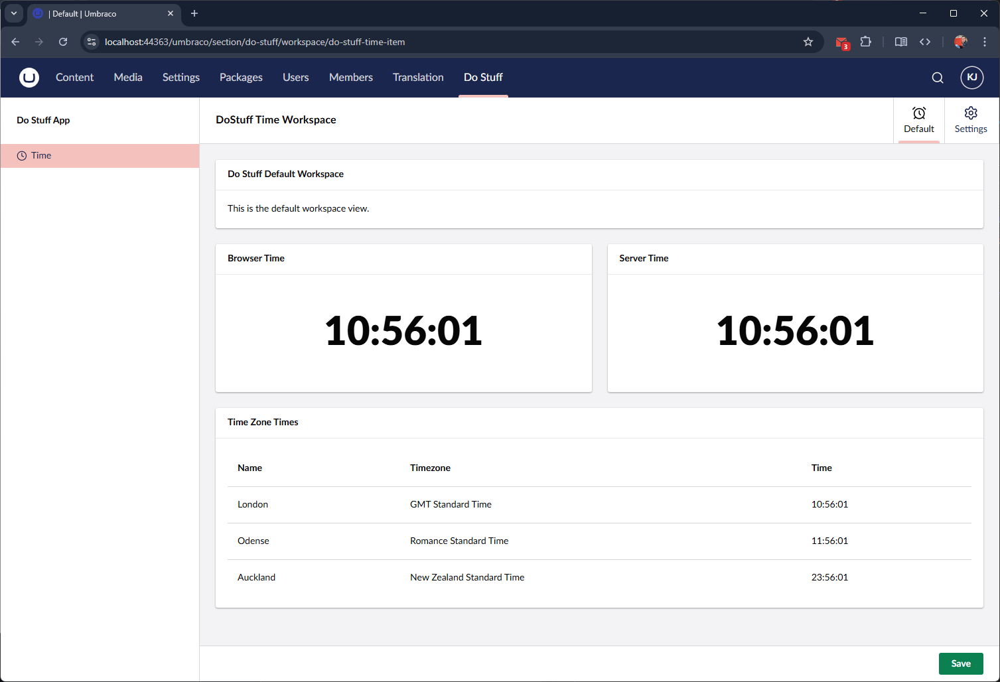
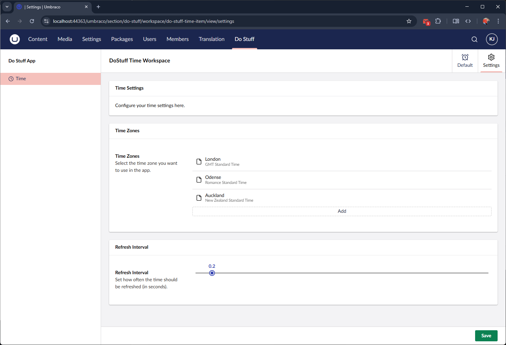

# Time Dashboard App.

The DoStuffWithUmbraco repo, contains a few examples of how to do things and most of them are deliverd though the "Time Dashboard".

A very basic Time dashboard was part of the [EarlyAdopter's Guide Umbraco v14 Series](https://dev.to/kevinjump/series/26221).

This repo brings it all upto date with Umbraco v17 and rounds out the functionality to make it more representative of things
you can do.

## Default View

The default view show you the time on the browser and the time on the server, alnong with any configured timezones you might have added.

This allows us to show the concepts of Contexts, and Repositories in the front end, and the Management API from the back end.

> [!TIP]
> For a simple use case like the time this might seem over engineered, but it is showing us how we can seperate out the data and the requests, you will notice even in the ManagementAPIs we don't just return the time, we call a `TimeService` to fetch the time - this is much more like the pattern you are likely to use on complicated sites.

## Settings View

The Settings dashboard, allows you to setup some basic settings for the default view, from refresh time (how long between pollling), to additional cultures.

This allows us again to show the concept of the Content and repositories in the front end, and the management API to get and set values.

It also allows us to build up a Repo/Service layer in the backend and custom build database tables and migrations, so you can see how your data can be saved and retirevied via standard umbraco patterns.
